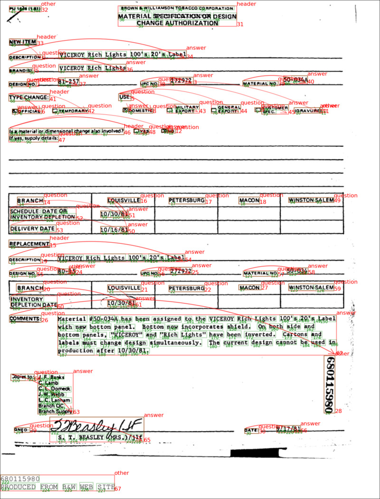

# About FormUnderstanding

[Form Understanding](https://link.springer.com/chapter/10.1007/978-3-030-86159-9_27) is a task to understand the structure of a form and extract information from it.
And consists of three sub-tasks: 
- (1) Word grouping to form entities
- (2) Entity labeling
- (3) Entity linking 

# What is an entity?
Entities are like "NEW ITEM", "DESCRIPTION", "VICEROY Rich Lights" in the image above. (They are in red boxes)
Entities are consist of single/multiple words like "DESCRIPTION", "NEW ITEM" and "VICEROY Rich Lights"

# Entity Extraction(EE or NER) vs Entity Linking(EL)
 
*FUNSD visualized sample*

From above image,
 - Red boxes : texts in red boxes are entities
 - Curved red arrows : links between entitiesc
 - Red numbers : entity indices in FUNSD dataset (orders of them)
 - Green boxes : texts in green boxes are words of each entity
 - Green numbers : orders of words in each entity

EE task is often referred as NER task in other papers.

# Entity Extraction(EE) Task Approaches
There are multiple approaches to solve this task.

- Tagging : BIO, BIOES
- Linking : initial token classification + sequence token classification

### Why do we want to use tagging from the first place?
Because without tagging, we do not know if two or more of same entities are next to each other.
Imagine a situation where the label is "restaurant" and input text sequence to the model is "Shake Shake Burger Burger King"

Without Tagging, we would make gt as
```python
words:  ["Shake", "Shake", "Burger", "Burger", "King"]
labels: ["restaurant", "restaurant", "restaurant", "restaurant", "restaurant"]
```
and even if model predicts it right, we have **no way to separate those two entities**.

But if train model to predict
```python
words:  ["Shake", "Shake", "Burger", "Burger", "King"]
labels: ["B-restaurant", "I-restaurant", "I-restaurant", "B-restaurant", "I-restaurant"],
```
we can **easily separate those two entities**.

But there is a problem with this approach, which is that the order of the words in the entity should be preserved; Otherwise, we cannot correctly group the words into the corresponding entity

### BIO, BIOES tagging examples

In FUNSD, there are 4 classes : "question", "answer", "header", "other".

##### For BIO tagging (begin, in, out)
- single word "question" Entity : 
```python
["B-question"]
```
- multiple word "question" Entity : 
```python
["B-question", "I-question", "I-question", "B-question", "I-question", "B-question", ...]
```
- others Entity : 
```python
["O", "O", "O", ...]
```

##### For BIOES tagging (begin, in, out, end, single)
- single word "question" Entity : 
```python
["S-question"]
```
- multiple word "question" Entity : 
```python
["B-question", "I-question", "I-question", "E-question", "B-question", "I-question", "S-question", ...]
```
- "others" Entity : 
```python
["O", "O", "O", ...]
```

## Itc, Stc examples


# Entity Linking(EL) Task Approaches

-


